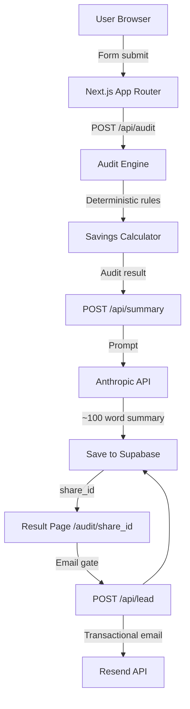

# SpendLens Architecture

## System Diagram

## Data Flow
1. User enters tools/plans in a Next.js client component form (state stored in `localStorage`).
2. Data is POSTed to `/api/audit` where Zod validation guarantees structure.
3. The server runs the deterministic audit engine (zero API/DB dependencies) to calculate savings.
4. The server hits the Anthropic API with the audit results to generate a personalized summary.
5. The combined result is written to Supabase using the service role key and a secure `nanoid` is returned.
6. The client redirects to `/audit/[shareId]`.
7. Users can opt-in to lead capture, hitting `/api/lead` which records their email in Supabase and triggers a Resend confirmation.

## Stack Rationale
- **Next.js 14 App Router**: Allows seamless server/client boundaries, ensuring API keys and LLM interactions remain securely on the server.
- **Tailwind CSS + shadcn/ui**: Fast styling and accessible components suitable for a modern SaaS aesthetic.
- **Supabase**: Postgres with Row Level Security allows public read for shared results but secure, service-role-only inserts.
- **Anthropic Claude**: Sonnet 4 model offers excellent cost-to-performance for summarizing data blocks safely.

## Scaling to 10k Audits/Day
- The deterministic rules run locally in Vercel functions (near-zero latency).
- Supabase easily handles 10k inserts/day on its free tier.
- Anthropic API calls are the main bottleneck. We use a 5-second timeout and a deterministic fallback summary to ensure 100% uptime for the user even if Anthropic rate-limits or times out.
